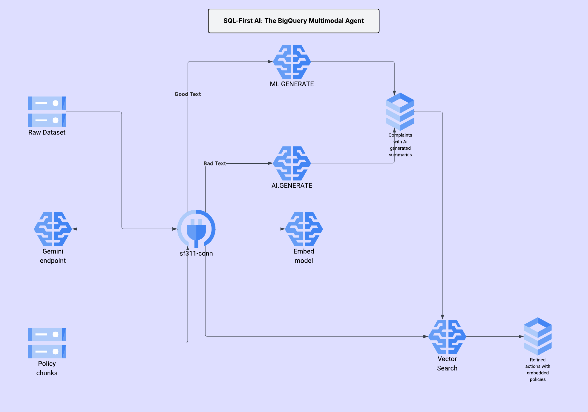

## City311 Multimodal Triage with BigQuery AI

This repository contains a SQL-first prototype for a multimodal triage agent that processes San Francisco 311 service requests. The entire pipeline is orchestrated within Google BigQuery, leveraging its native AI capabilities to classify unstructured complaints, match them to official city policies using vector search, and generate refined, policy-aligned actions.
---

## 📌 Problem

City 311 systems are inundated with unstructured data. Complaints arrive as free-form text, often with crucial details missing, and sometimes only as an image with no text at all. On the other side, city policies are stored in dense, hard-to-search documents. This mismatch makes manual triage by city agents slow, inconsistent, and difficult to scale.

---

## 🤖 The Solution: A Multimodal RAG Agent in SQL

This project builds an end-to-end **Retrieval-Augmented Generation (RAG)** agent inside BigQuery to solve this problem. The agent intelligently processes each complaint, retrieves the most relevant city policy, and uses that policy to inform its final recommendation.

The pipeline uses four key BigQuery AI features:

1.  **Multimodal Understanding**: For complaints with poor or missing text, Gemini is used via **Object Tables** to generate a concise summary from the user-submitted image.
2.  **Structured Triage**: Gemini (`AI.GENERATE`) analyzes the complaint summary to extract a structured JSON object containing the `theme`, `severity`, and an initial `suggested_action`.
3.  **Policy Retrieval**: Complaint summaries are converted into vector embeddings (`ML.GENERATE_EMBEDDING`) and compared against a pre-indexed catalog of city policies using `VECTOR_SEARCH` to find the most relevant policy snippet.
4.  **Policy-Grounded Refinement**: A final call to Gemini synthesizes the complaint, the initial action, and the retrieved policy to generate a `refined_action` that is specific, actionable, and aligned with official city regulations.

---

## 🏗 Architecture

A visual representation of the end-to-end pipeline.


---

---

## 🏆 Key Results & Impact

The multimodal AI agent demonstrated a significant improvement over a traditional, text-only approach by effectively processing complaints that were previously unusable.

---
## 📈 Impact Statement

This BigQuery-native AI agent transforms the 311 triage process from a slow, manual task into a fast, consistent, and scalable automated workflow.

### Business Impact
By automatically processing complaints and grounding them in official policy, the agent drastically reduces the need for manual intervention.

* **Assumption:** A city agent takes a conservative average of **3 minutes** to manually triage one case.
* **Performance:** The agent successfully found a relevant policy for **~70%** of the 1,000 cases in the test cohort.
* **Estimated Impact:** This translates to **35 hours of manual work saved** for every 1,000 complaints processed, freeing up city personnel to focus on more complex case resolution.

### Platform Impact: The Power of BigQuery-Native AI
Beyond the business outcomes, this project highlights the significant performance and productivity gains of using BigQuery's integrated AI services:

* **Cost-Effectiveness:** This entire prototype, including multiple pipeline runs and experiments on a 1000-case cohort, was developed for **under $5 USD**, demonstrating the extreme cost-effectiveness of building and testing sophisticated AI solutions with BigQuery.
* **Scalability and Speed:** Invoking generative models directly on thousands of rows with a single SQL statement is a game-changer. BigQuery handles the parallel execution and scaling automatically, transforming what would be a complex, slow, row-by-row API loop into a single, efficient query.
* **Unified Architecture:** The seamless integration of data storage, vector search, and generative AI within one platform radically reduces architectural complexity, removing the need to move data between a data warehouse and a separate vector database.

##  generalizing-the-impact-a-cross-industry-solution-

The SF311 Triage Agent is a blueprint for a powerful pattern that can be applied across any industry dealing with a mix of unstructured data and a need for consistent, policy-grounded decision-making.

### **Supply Chain & Logistics**

* **Use Case:** Automating the review of shipping exceptions by analyzing multimodal data (e.g., photos of damaged goods, scanned bills of lading) against a knowledge base of insurance policies and return protocols.
* **Estimated Impact:** Assuming 15 minutes of manual work per exception, an agent processing 1,000 exceptions per month could save over **250 hours of manual work monthly**, accelerating claim resolutions and reducing operational overhead.

### **Finance & Compliance**

* **Use Case:** Performing initial compliance reviews on loan applications by reading submitted documents (pay stubs, bank statements) and validating them against a knowledge base of complex underwriting guidelines and regulations.
* **Estimated Impact:** Assuming 20 minutes saved per initial review, a bank processing 5,000 applications a month could save over **1,600 hours of analyst time**, leading to faster loan approvals and improved compliance accuracy.

### **Marketing & Brand Management**

* **Use Case:** Analyzing user-generated content (e.g., Instagram photos and comments) to identify product usage, detect brand misuse, and generate on-brand draft responses based on a knowledge base of marketing guidelines.
* **Estimated Impact:** Assuming 5 minutes saved per social media interaction, a brand with 10,000 mentions per month could save over **800 hours of social media management time**, while ensuring a more consistent and responsive brand voice.

### **Product Development & Support**

* **Use Case:** Triaging user-submitted bug reports by reading screenshots of error messages and searching a knowledge base of technical documentation and known issues to categorize the bug and suggest initial diagnostic steps.
* **Estimated Impact:** Assuming 10 minutes of a product manager's or engineer's time is saved per bug, a product with 500 bug reports per month could save over **80 hours of valuable development time**, allowing teams to fix bugs faster and focus on building new features.

---
## 🏆 Key Results: A Tale of Two Pipelines

To measure the reliability of the image analysis pipeline, it was run in two modes: a **Baseline** version using public URLs, and an **Improved** version using GCS-hosted images via a BigQuery Object Table. The results revealed a critical insight into building robust AI systems.

### Quantitative Comparison

| Metric                 | Baseline (Public URL) | ✅ Improved (Object Table) |
| :--------------------- | :-------------------: | :-----------------------: |
| Match Rate             |         72.9%         |           69.9%           |
| Refinement Success     |         67.5%         |           41.3%           |

### Analysis: Uncovering the "Silent Failure"
### Qualitative Comparison: The "Silent Failure"

The most significant finding was the difference in summary quality for cases where the public URL was inaccessible. The following table shows how the Improved pipeline provides accurate, specific summaries where the Baseline version failed.

| Complaint Type | Baseline Summary (from Public URL) | ✅ Improved Summary (from Object Table) |
| :--- | :--- | :--- |
| Damaged Sign | A large pile of trash... | The photo shows a damaged street sign... |
| Pothole | A large pile of trash... | The photo shows a pothole in the street... |
| Fallen Tree | A large pile of trash... | A fallen tree branch obstructs the sidewalk... |

While the baseline pipeline scored higher, this was a misleading result caused by the AI model's **"silent failure"** when trying to access unreliable public URLs. Instead of returning an error, the model hallucinated the same generic "pile of trash" summary for many different types of issues. This incorrect summary then consistently (but wrongly) matched with a general-purpose garbage policy.

The improved pipeline, by using reliable `gs://` URIs, generated highly accurate and diverse summaries for issues like "potholes," "damaged street signs," and "fallen tree branches." The lower scores reflect that our small, curated **`policy_catalog` had a "content gap"** and did not contain specific policies for these new, correctly identified problems. This is ultimately a success, as the system is now intelligent enough to identify the precise areas where its knowledge base needs to be expanded.

---

## 🔧 How to Reproduce

The entire pipeline can be reproduced from a Google Cloud Shell environment. The process is designed to be run sequentially from a fresh clone of the repository.

1.  **Clone the Repository & Set Project**: Start by cloning the repository and setting your active Google Cloud project.

    ```bash
    # --- IMPORTANT: UPDATE THIS VARIABLE ---
    export GCLOUD_PROJECT="your-project-id"
    # ---
    gcloud config set project $GCLOUD_PROJECT
    cd ~
    rm -rf sf311-triage-bigquery-ai
    git clone https://github.com/nithingodi/sf311-triage-bigquery-ai.git
    cd sf311-triage-bigquery-ai


    ```

2.  **Grant User Permissions**: You must grant your user the ability to act as a Service Account User. This is a one-time setup step for your user in this project.

    ```bash
    USER_EMAIL=$(gcloud config get-value account)
    gcloud projects add-iam-policy-binding $GCLOUD_PROJECT \
        --member="user:$USER_EMAIL" \
        --role="roles/iam.serviceAccountUser"
    echo "Waiting 60 seconds for IAM permissions to propagate..."
    sleep 60
    ```

3.  **Create Core Infrastructure**: The following commands create the necessary BigQuery dataset and the `CLOUD_RESOURCE` connection that allows BigQuery to communicate with Vertex AI and Google Cloud Storage.

    ```bash
    # Create the BigQuery dataset
    bq mk --dataset --location=US $GCLOUD_PROJECT:sf311

    # Create the unified connection
    bq mk --connection --location=US --project_id=$GCLOUD_PROJECT \
        --connection_type=CLOUD_RESOURCE sf311-conn

    # Get the connection's service account
    CONNECTION_SA=$(bq show --connection --format=json $GCLOUD_PROJECT.US.sf311-conn | jq -r '.cloudResource.serviceAccountId')

    # Grant the connection's service account the required roles
    gcloud projects add-iam-policy-binding $GCLOUD_PROJECT \
        --member="serviceAccount:${CONNECTION_SA}" \
        --role="roles/aiplatform.user"
    gcloud projects add-iam-policy-binding $GCLOUD_PROJECT \
        --member="serviceAccount:${CONNECTION_SA}" \
        --role="roles/storage.objectViewer"
    echo "Waiting 60 seconds for IAM permissions to propagate..."
    sleep 60
    ```


#### **Running the Pipeline Comparison**

**Step 4: Run the Baseline Pipeline (Public URL Method)**
This first run establishes the 1000-case cohort (`batch_ids` table) and generates the first set of results.
```bash
make run_all
```

By following the below steps,one can run the pipeline that uses object table to summarize images(baseline uses ai.generate to access public urls)


**Step 5: Prepare GCS for the Improved Pipeline**
Now that the `batch_ids` table exists, this script downloads the corresponding images to your GCS bucket.
```bash
python3 scripts/setup_gcs.py
```
Next, create object table that points to theose images
```bash
bq query --nouse_legacy_sql "
CREATE OR REPLACE EXTERNAL TABLE \`$GCLOUD_PROJECT.sf311.images_obj_cohort\`
WITH CONNECTION \`projects/$GCLOUD_PROJECT/locations/US/connections/sf311-conn\`
OPTIONS (
  object_metadata = 'SIMPLE',
  uris = ['gs://$GCLOUD_PROJECT-sf311-data/sf311_cohort/images/*.jpg']
);"
```
**Step 6: Run the Improved Pipeline (Object Table Method)**
To run the second, more reliable version of the pipeline on the **exact same cohort**:
1.  **Edit the `Makefile`**: Open the `Makefile` and find the `image_summaries` target. Change the filename from `03_image_summaries.sql` to `03_image_summaries_v2_objtable.sql`.
2.  **Clean and Re-run**: Run the following commands to clear the old results and then execute the rest of the pipeline manually.
    ```bash
    # First, clear the summary results from the last run
    make clean_summaries

    # Now, run the remaining pipeline steps manually
    make image_summaries
    make case_summaries
    make triage
    make label_taxonomy
    make policy_catalog
    make embeddings
    make refinement
    make dashboards
    make comparison
    ```
---
## 📂 Project Structure

The repository is organized with all SQL scripts in a dedicated directory and a `Makefile` at the root for easy execution.

* `sf311-triage-bigquery-ai/`
    * `Makefile`
    * `README.md`
    * `LICENSE`
    * `survey.txt`
    * `.gitignore`
    * `scripts/`
        * `01_policy_ingestion.sql`
        * `02_models.sql`
        * `02_views.sql`
        * `03_image_summaries.sql`
        * `03_image_summaries_v2_objtable.sql`
        * `03_quality_and_cohorts.sql`
        * `04_case_summaries.sql`
        * `04_triage_generate_v2.sql`
        * `05_label_taxonomy.sql`
        * `05_policy_catalog.sql`
        * `05_policy_chunks_for_embedding.sql`
        * `05_policy_chunks_validation.sql`
        * `05_policy_embeddings.sql`
        * `06_embeddings_and_search_tuned.sql`
        * `07_refine_prep.sql`
        * `07_refinement.sql`
        * `08_dashboards.sql`
        * `09_proto_comparison.sql`
        * `10_validation.sql`
        * `setup_gcs.py`


---

## ⚠️ Limitations

* **Small Policy Catalog**: The current policy catalog was hand-curated for this prototype. A production deployment would require a more robust ingestion pipeline to automatically parse and index the full set of city codes and policy documents.
* **Batch-Only Architecture**: The pipeline is designed for batch execution as required by the Kaggle competition scope. It does not include a real-time streaming architecture for immediate, on-arrival complaint processing.

---

## 🚀 Future Work

This prototype demonstrates that traditional barriers for unstructured data can be overcome with BigQuery AI. It serves as a powerful foundation for several exciting, production-ready enhancements.

### Continuous Model Improvement Loop
The outputs of this pipeline, especially the actions flagged for `review`, can serve as a valuable feedback mechanism for the underlying Gemini models. By analyzing cases where the AI struggled to generate a policy-aligned action, product teams can identify specific weaknesses and fine-tune future model versions for better instruction-following and reasoning in a RAG context.

### Cost-Optimization via Case-Based Reasoning
Instead of relying on the generative model for every new complaint, the agent could be enhanced to first perform a `VECTOR_SEARCH` for *semantically similar historical complaints*. If a similar, successfully resolved case is found, its `refined_action` can be reused directly. This would significantly reduce calls to the generative AI endpoint, leading to substantial cost savings at scale.

### Hybrid Image Processing for Storage Efficiency
To optimize storage costs and data processing, the image summarization step could be evolved into a two-stage, "on-demand" process. The agent would first attempt to summarize an image using its public URL. **Only if that fails** would it trigger the workflow to download the image to GCS and re-process it using the more reliable Object Table method. This hybrid approach minimizes storage footprint while ensuring high reliability.

### Generalization to New Business Domains
This agent's pattern can be adapted for other business domains that involve multimodal input and require policy-aligned resolutions, such as customer support ticket triage or insurance claim verification.

### Real-Time Streaming Pipeline
The batch architecture could be evolved into a real-time streaming service using **Cloud Functions** and **Pub/Sub**. This would allow complaints to be triaged, classified, and matched to policies within seconds of their submission.
---

## 📑 License

This project is licensed under the MIT License.


